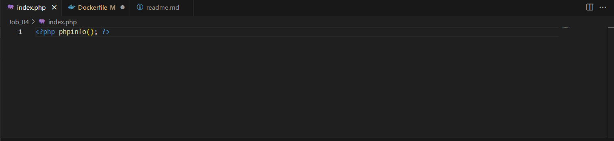
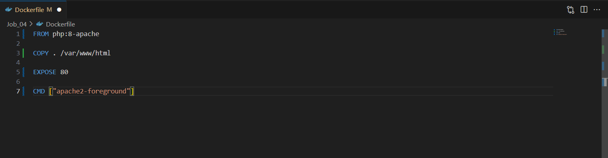
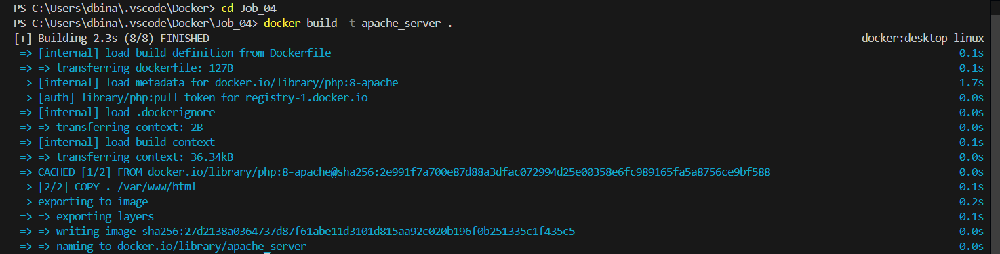
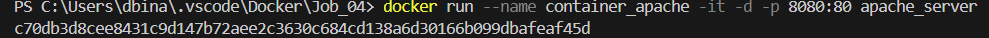
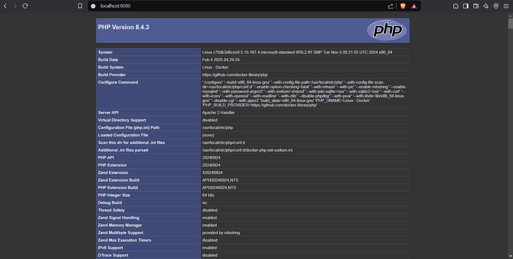
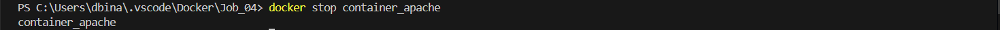

# Runtrack Docker : Job 04 

```sh
phpinfo();
``` 
We create a`index.php` file with this command within it to display informations about our apache server.



----

Once this is done we create a Docker file that will generate an Apache environment to display this page :

```sh
FROM php:8-apache
``` 

`FROM` decides which image will be used as base for the ones we create in this directory. Here it will be  Apache


```sh
COPY . /var/www/html 
```

Copies everything from the current folder to `/var/www/html`. 

`Apache` inside our container serves files from this directory by default, it will look for `index.php` in that folder so if it's empty there will be an error message like this one on the web page :

 (This image was taken on the internet for the purpose of the explaination)

```sh
EXPOSE <port_of_your_choice> 
```
This is just documentation dor humans to understand which port the container is using. You still need to use the `p`command when creating your container to make service accessible. 

```sh
CMD ["options"]
```

This command lets you decide which command will execute themselves automatically when you create a container. In our case the command is `CMD ["apache2-foreground"]` which is a script included in php:8-apache Docker image. It ensures that the apache server doesn't run on the background so that the container doesn't stop. 

We can now use all of those commands to create our Dockerfile like so :



----

We can test our Dockerfile by creating an image and running a container with it. 

* To do so, let's first navigate through our files and place ourselve in the same directory as the Dockerfile. 
* After that we can build the image :



Then we run a container using this image and check its port to see if all is well :





We can stop it if we want :



