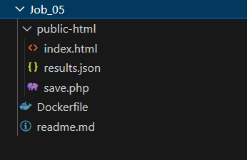
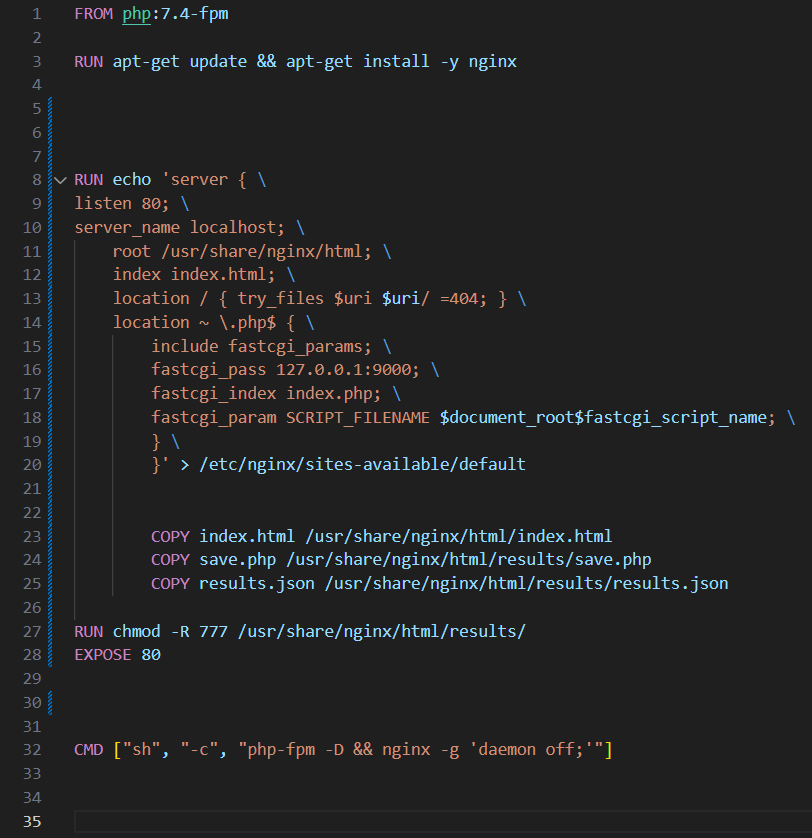
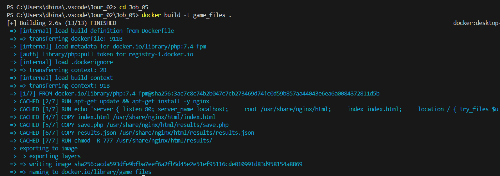
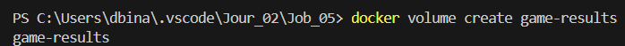
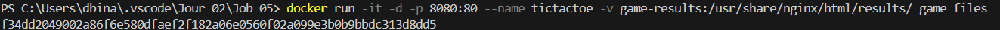

### Runtrack Docker Jour 02 : Job 04

To setup our Docker project for a web application, we need those files in our vscode project folder :




We are going to host a "tic-tac-toe" game using Docker. 

To do so we need to create a Docker file that will define how our images interact with our other files and the container's volume (we will see about that a bit later). 

```sh
FROM <base_image>
```
Defines the base image for the Docker containers. 

```sh
RUN <your_command>
```
This command lets use execute commands durign the image building process, it does not run commands when the container starts.

```sh
COPY <file_path> <path_to_copy_into>
```

It's used to copy files from one directory to another, useful when we want to store data of any sort. 

```sh
chmod <permissions>
```

Assigns access and permission. It can be used for various reasons, from giving files some persmissions, to user acces to other files.

```sh
EXPOSE <port>
```

Declares which port the container will listen to at runtime though you still need to use the `-p` command when running your container since it doens't actually open the port or make it accessible from outside said container. 

```sh
CMD <your_command>
```

A start command, sets default command to run when the container starts



In our file we proceeded as follows with these commands :

```sh
FROM php:7.4-fpm
```

We set the base image to PHP-FPM. PHP-FPM executes PHP script in the background and sends it to web servers like nginx.

```sh
RUN apt-get update && apt-get install -y nginx
```

`apt-get update` updates the systems  `apt-get install -y nginx` installe nginx pour servir les fichiers et traiter les requètes.

```sh
RUN echo <nginx_setup>
```

* Listens to port 80 `listens 80;`
* Defines root for website `root /usr/share/nginx/html;`
* home page `index.html`
  
Request management :
* Tries to load requested file, if it can't displays error 404 message : `try _files $uri/=404`
* Nginx can't treat php files so it sends the php requests to PHP-FPM that will execute them and return them to nginx to display them on the web page : `fastcgi_pass 127.0.0.1:9000;`
* Copy `index.html`, `save.php` and `results.json` towards /usr/share/nginx/html which is the website's root :
  How it works
  * `index.html` is in /usr/share/nginx/html since it's the main page.
  * `save.php` and `results.json` are stored in `/usr/share/nginx/html/results/`
* Acces permissions : `RUN chmod -R 777 /usr/share/nginx/html/results/` -> Gives full access (reading, writing, execute)
* Exposing port : Indicates to Docker that containers will listen on the 80 port (we will still have to set a port up using the `-p` command while creating it) : `EXPOSE 80`. 
  * Start command :
    *  Runs a shell : `-sh` , `-c` tells `sh` to execute the command that follows as a string. This ensures that the whole command is executed. 
    *  Launches PHP-FPM in the background : `php-fpm -D`
    *  Launches nginx on the foreground : `nginx -g 'deamon off;'` 
  This garanties the container won't be deleted if shut down.


We are going to create an image to serve the game files, to make it clearer in our process, we are simply calling it `game_files` :



```sh
docker volume create <volume_name>
```

Next we create a volume to store our game results, you guessed it, we are calling it `game-results`.



```sh
docker volume ls
```

This command checks all the volumes you have stored locally. 


```sh
run -it -d -p  <your_port> --name <container_name> -v <volume_name>:/creating/path/for/storage/ <image_name>
```

Once we have one, we can run a container, using our image, and mouting a volume in the process.



